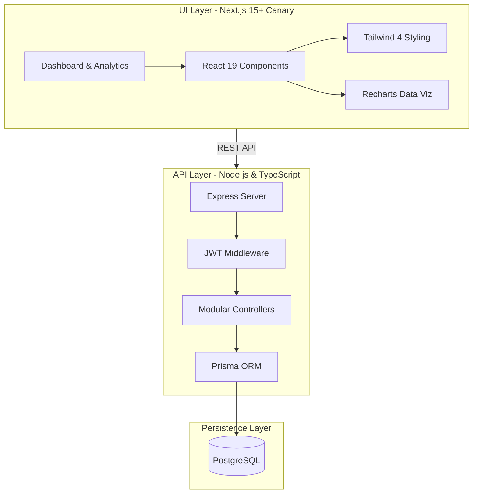

# 📦 CoreInventory: The Future of SaaS Stock Management 🚀

[](https://nextjs.org/)
[](https://reactjs.org/)
[](https://www.typescriptlang.org/)
[](https://tailwindcss.com/)
[](https://expressjs.com/)
[](https://www.prisma.io/)
[](https://www.postgresql.org/)

**CoreInventory** is a premium, high-performance SaaS solution engineered for real-time inventory intelligence, seamless multi-warehouse orchestration, and deep analytical auditing. Designed for the high-stakes supply chain, it combines state-of-the-art engineering with a stunning, high-contrast aesthetic.

---

## ✨ Key Features & Innovation

### 🛡️ Immutable Stock Ledger
Unlike traditional systems, every stock change in CoreInventory is logged in an **immutable audit trail**. This ensures 100% transparency and compliance, making it impossible to "ghost" stock changes.

### 📊 Real-Time KPI Drill-Down
Navigate from high-level metrics to granular data in milliseconds. Our dashboard KPIs (Low Stock, Pending Deliveries, Active Transfers) are interactive, providing instant visibility into operational bottlenecks.

### 🏢 Multi-Hub Orchestration
Manage complex stock movements between globally distributed warehouses with dedicated `Stock-In`, `Stock-Out`, and `Internal Transfer` workflows.

### 🎨 Premium Aesthetics
A sophisticated, high-contrast design optimized for inventory managers. Micro-animations with Framer Motion provide a fluid, premium UX that reduces eye strain and improves performance.

---

## 🏗️ System Architecture

CoreInventory is built on a **High-Decoupled Client-Server Architecture** for maximum scalability and independent deployment.



---

## 💾 Database Design Philosophy

Our PostgreSQL schema is designed for **Atomic Consistency** and **Auditability**.

- **Junctioned Inventory**: A dedicated `Inventory` model tracks product-warehouse associations with O(1) read efficiency for stock levels.
- **Relational Integrity**: Strict foreign key constraints ensure that no orphan stock movements can ever exist.
- **Reference Tracking**: Every `StockLedger` entry holds a polymorphic reference to the originating operation (Receipt, Delivery, or Adjustment).

---

## 🛠️ Technology Deep-Dive

| Layer | Technology | Why we chose it? |
| :--- | :--- | :--- |
| **Frontend** | **Next.js 15+ (App Router)** | For lightning-fast SSR and structured routing. |
| **Logic** | **TypeScript** | For end-to-end type safety and reducing runtime errors. |
| **Styling** | **Tailwind CSS 4** | To build a custom, performant design system without CSS bloat. |
| **Database** | **Prisma & PostgreSQL** | For type-safe queries and a robust, scalable relational engine. |
| **Validation** | **Zod** | Ensuring data integrity from the frontend request to the backend db. |

---

## 🚀 Speed-Dating with the Codebase

### 1. ⚙️ Ignition (Backend)
```bash
cd backend
npm install
# 📝 Set your DATABASE_URL in .env
npx prisma migrate dev
npm run dev
```

### 2. ⚡ Launch (Frontend)
```bash
cd frontend
npm install
npm run dev
```

---

## 👨‍💻 Submission Context
This project was developed for a professional hackathon environment, focusing on **Edge Cases**, **Data Reliability**, and **User-Centric Design**. It represents a complete, ready-to-scale MVP for the inventory SaaS market.

**Developed with ❤️ and Precision by Team Tech Titans Go.**
